<p align="center">
  
</p>

<h3 align="center">Pixel art without GPU. Any LLM can draw.</h3>

<p align="center">
  No GPU. No image model. No multimodal. No dependencies.<br>
  <b>Any text-only LLM + size + prompt → pixel art HTML</b>
</p>

<p align="center">
  <a href="https://sbname.github.io/yoyopixel/showcase.html"></a>
  <a href="#install-as-claude-code-skill"></a>
  <a href="pixelart-skill.md"></a>
  <a href="LICENSE"></a>
</p>

---

## What is YoYoPixel?

**Text-only LLMs can generate images — no GPU, no DALL-E, no multimodal model needed.**

YoYoPixel is a skill/prompt framework that teaches any LLM (Claude, GPT, Gemini, Llama, Qwen...) to generate pixel art as pure HTML/CSS/JS code. The LLM writes structured text data, the browser renders it as pixel art.

```
Traditional: prompt → GPU → image model → PNG
YoYoPixel:   prompt → any text LLM → HTML code → pixel art in browser
```

```
/pixelart 32x32, a wizard with a glowing staff
```

The AI auto-decides everything: palette, detail level, rendering method, shading, animations, atmosphere. No configuration needed.

### Capabilities at a glance

| Size Range | What it can do | Rendering |
|-----------|----------------|-----------|
| **8×8** | Icons, emojis, game items (sword, potion, key, chest) | CSS box-shadow |
| **12–16px** | Character sprites, avatars, simple creatures | CSS Grid + JS |
| **24–32px** | Detailed characters with outfits, weapons, accessories | CSS Grid + JS |
| **48px+** | Complex illustrations with sub-pixel shading | CSS Grid + JS |
| **48–96px** | Game assets, buildings, animals, tilesets | Procedural texture engine |
| **96–256px** | Full procedural landscapes, cityscapes, world landmarks | Canvas + FBM noise |

---

## Install as Claude Code Skill

### Option 1: Project-level (recommended)

```bash
# Clone
git clone https://github.com/SbName/yoyopixel.git

# Copy skill into your project
cp -r yoyopixel/.claude/skills/pixelart YOUR_PROJECT/.claude/skills/
```

### Option 2: Global (all projects)

```bash
cp -r yoyopixel/.claude/skills/pixelart ~/.claude/skills/
```

### Use it

```
/pixelart 16x16, a fire mage with staff
/pixelart 32x32, cyberpunk cat with neon goggles
/pixelart 192x128, mountain sunset with lake reflection
/pixelart 24x24, ancient Chinese swordsman in moonlight
/pixelart 80x85, stone cottage with red tile roof
/pixelart 50x40, a fox sitting in grass

# Tileset mode — generates 25-40 related assets on one sheet
/pixelart tileset, medieval village
/pixelart tileset, dungeon crawler
```

Two input modes: **size + prompt** for single assets, **tileset + theme** for full sprite sheets.

Claude auto-decides everything based on size and prompt:
- **Size** determines detail level, max colors, and shading complexity
- **Prompt content** determines rendering method (CSS Grid, Canvas landscape, or procedural texture engine)
- **Keywords** trigger auto-animations (weapon → gleam, night → stars, fire → embers)
- **Subject type** selects texture algorithms (building → stone/tiles, animal → fur/scales/feathers)

---

## Showcases

> **[Live Demo](https://sbname.github.io/yoyopixel/showcase.html)** — try all demos online, no download needed.

| Page | Link |
|------|------|
| All-in-one Showcase | [sbname.github.io/yoyopixel/showcase.html](https://sbname.github.io/yoyopixel/showcase.html) |
| Landscape Generator | [sbname.github.io/yoyopixel/landscape.html](https://sbname.github.io/yoyopixel/landscape.html) |
| World Wonders | [sbname.github.io/yoyopixel/wonders.html](https://sbname.github.io/yoyopixel/wonders.html) |
| Stone Cottage | [sbname.github.io/yoyopixel/prototype-cottage.html](https://sbname.github.io/yoyopixel/prototype-cottage.html) |
| Style Gallery | [sbname.github.io/yoyopixel/prototype-gallery.html](https://sbname.github.io/yoyopixel/prototype-gallery.html) |
| Animals | [sbname.github.io/yoyopixel/prototype-animals.html](https://sbname.github.io/yoyopixel/prototype-animals.html) |

### Characters & Scenes

<table>
<tr>
<td align="center"><b>Swordsman</b><br><sub>16×24 · Moonlit scene</sub><br>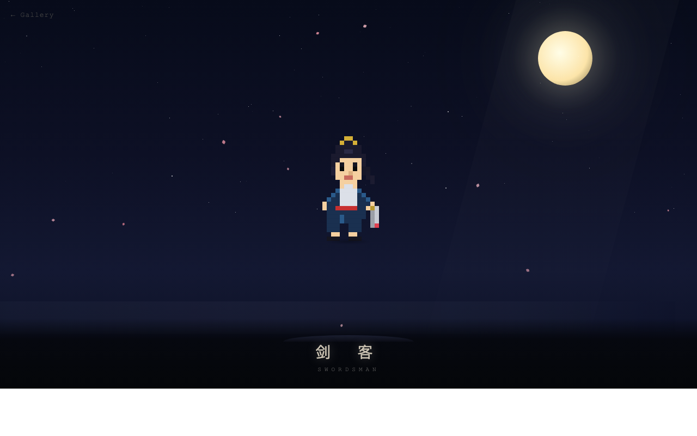</td>
<td align="center"><b>Cyberpunk Girl</b><br><sub>32×32 · Neon rain</sub><br>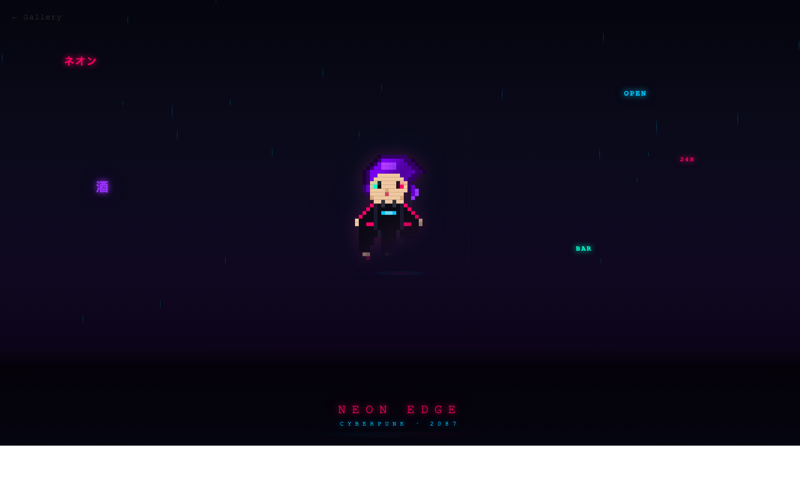</td>
</tr>
<tr>
<td align="center"><b>Fire Dragon</b><br><sub>24×24 · Ember particles</sub><br>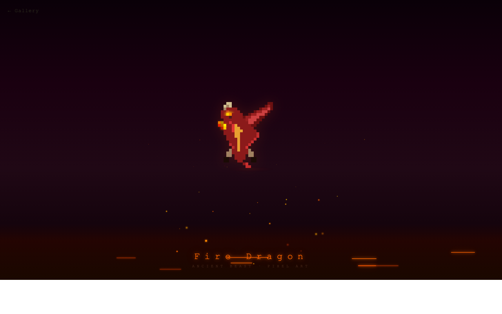</td>
<td align="center"><b>Pixel Icons</b><br><sub>8×8 · 12 game icons</sub><br>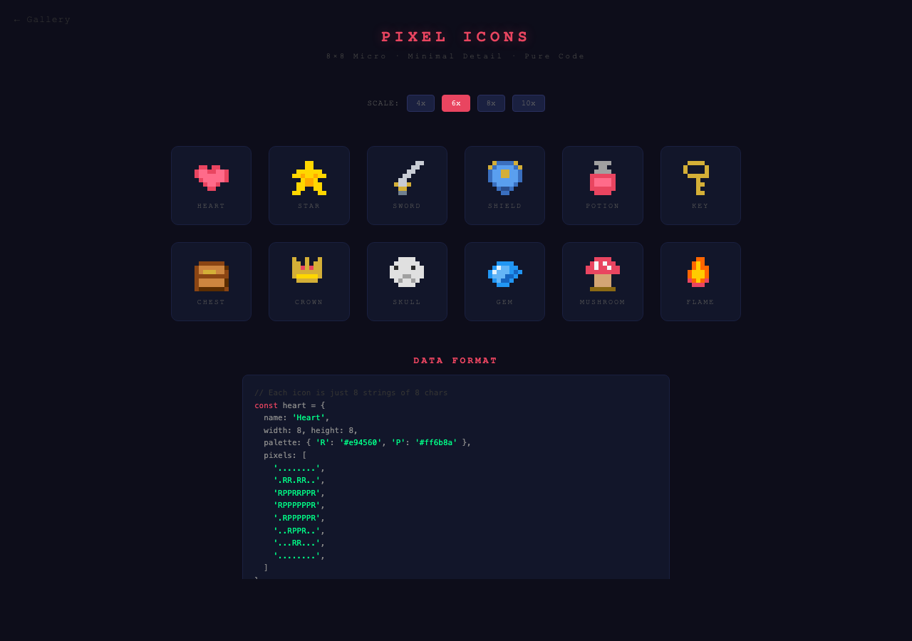</td>
</tr>
</table>

### Procedural Generators

<table>
<tr>
<td align="center"><b>Landscape Generator</b><br><sub>FBM noise · 5 biomes · up to 256×144</sub><br>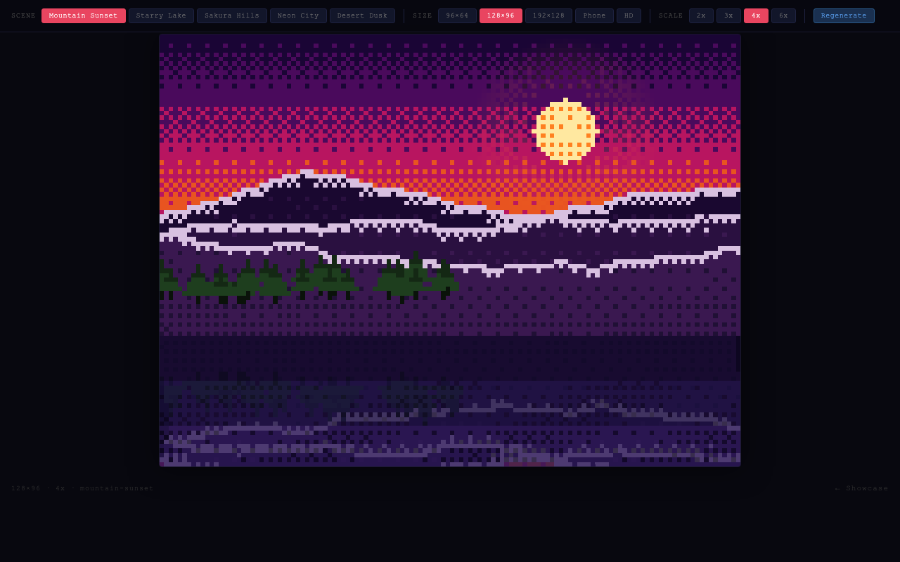</td>
<td align="center"><b>World Wonders</b><br><sub>8 landmarks · Pyramids, Great Wall, Taj Mahal...</sub><br>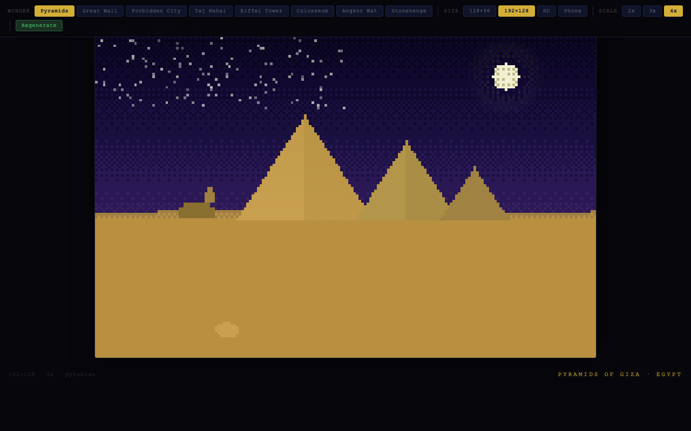</td>
</tr>
</table>

### Procedural Texture Engine (NEW)

Game-ready assets using region-based procedural textures — LLM declares regions + materials, engine auto-fills textures:

<table>
<tr>
<td align="center"><b>Stone Cottage</b><br><sub>80×85 · Voronoi stone, offset-grid roof tiles, stucco, wood grain</sub><br>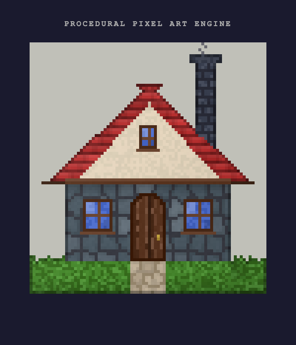</td>
<td align="center"><b>Style Gallery</b><br><sub>Wizard tower, sakura tree, treasure chest, village well</sub><br>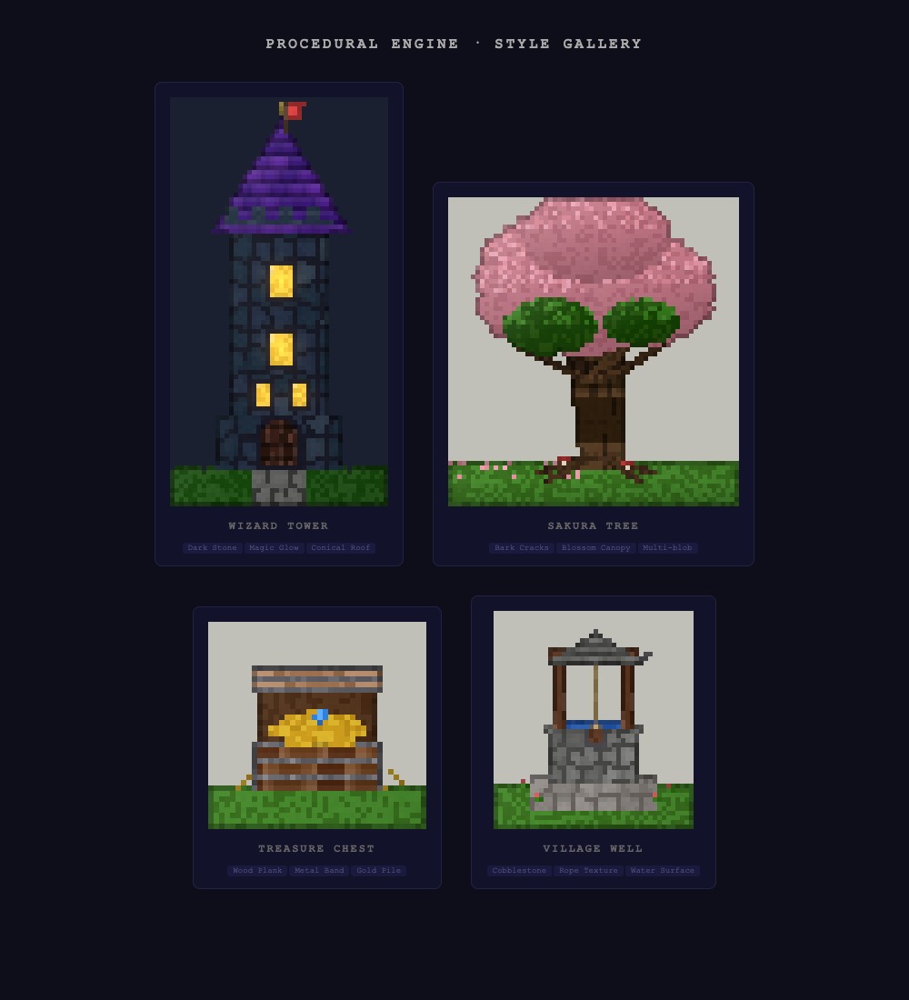</td>
</tr>
<tr>
<td colspan="2" align="center"><b>Organic Textures</b><br><sub>Fox (fur strands) · Koi (fish scales) · Owl (feather barbs) · Snail (spiral shell)</sub><br>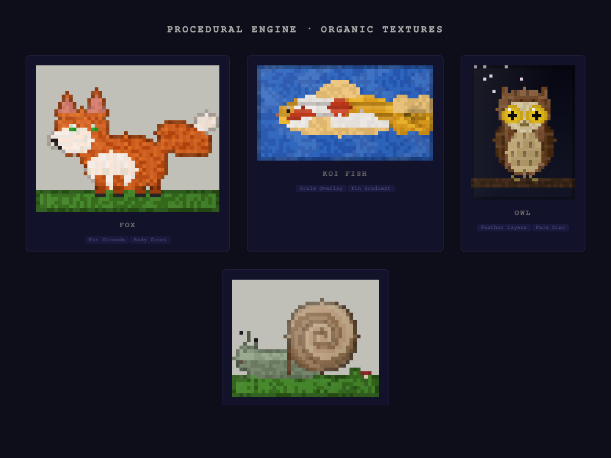</td>
</tr>
</table>

12 procedural texture algorithms: stone, tiles, stucco, wood, planks, bark, foliage, fur, scales, feathers, spiral, smooth

**Full tileset demo:**

<p align="center">
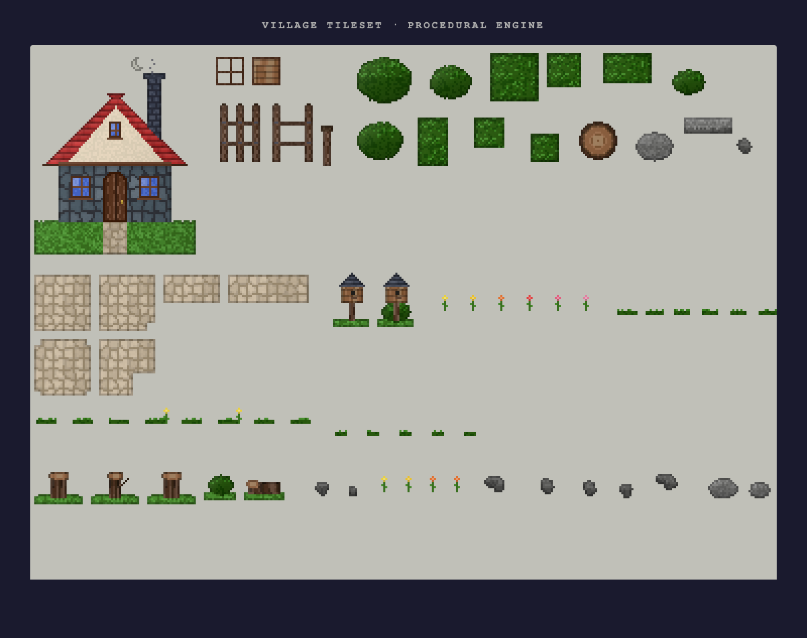
</p>
<p align="center"><sub>Village Tileset · ~35 assets · cottage, fences, crates, bushes, cobblestone paths, birdhouses, flowers, stumps, rocks</sub></p>

### Multi-Size Gallery

<p align="center">
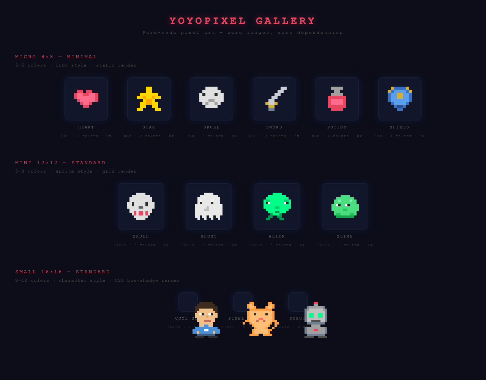
</p>
<p align="center"><sub>8×8 icons → 12×12 sprites → 16×16 avatars → 24×24 characters → 32×32 detailed</sub></p>

---

## How It Works

### Small art (≤48px): String-array pixel data

Each character in a string = one pixel. Human-readable, AI-writable.

```javascript
const wizard = {
  width: 24, height: 24,
  palette: {
    '.': 'transparent',
    'H': '#2a1a4e',     // hat
    'S': '#f5d0a0',     // skin
    'R': '#6a3cbf',     // robe
  },
  pixels: [
    '........HHHH............',
    '......HHHHHHHH..........',
    '....HHHHHHHHHHH.........',
    '...HHHSSSSSSSHHH........',
  ]
};
```

Rendered via **CSS Grid** (per-pixel animation) or **CSS box-shadow** (zero JS, pure CSS).

### Medium art (48–96px): Procedural texture engine

For game assets, buildings, creatures — the LLM declares **regions + materials**, the engine fills textures automatically:

```
Region-based: { shape: "rect", bounds: [12,47,68,74], material: "stone_wall" }
12 texture types: stone, tiles, wood, bark, foliage, fur, scales, feathers, spiral...
Auto post-processing: directional shading → edge outline → local shadows → glow
```

No per-pixel specification needed for surfaces. One engine generates cottages, towers, trees, foxes, owls, treasure chests — all with consistent style.

### Large art (≥64px): Canvas-based procedural generation

```
FBM Noise → Terrain shape
Ridge Noise → Mountain ridgelines
Bayer 4×4 Dithering → Palette-limited gradients
Layered Rendering → Sky → Stars → Clouds → Mountains → Trees → Water → Mist
```

All algorithms run in-browser. No server, no API calls.

---

## For AI Platforms

### Claude Code

Install the skill, then:
```
/pixelart 32x32, a knight in silver armor
```

### MCP / OpenClaw

```json
{
  "size": "32x32",
  "prompt": "a knight in silver armor"
}
```

### What the AI auto-decides

| Input | AI figures out |
|-------|---------------|
| Size `8x8` | minimal detail, 3-5 colors, CSS box-shadow, no animation |
| Size `32x32` | detailed, 12-20 colors, CSS Grid, breathe + gleam + fade-in |
| Prompt mentions "night" | adds stars, moon, mist atmosphere |
| Prompt mentions "fire" | adds ember particles, glow effects |
| Prompt mentions "sword" | adds gleam animation on weapon pixels |
| Size `192x128` | canvas mode, FBM noise, procedural generation |
| Prompt `tileset, village` | tileset mode, ~35 assets, procedural textures, shared palette, single sheet |

Full decision rules → [`pixelart-skill.md`](pixelart-skill.md)

---

## Tech Stack

| Component | Technology |
|-----------|-----------|
| Rendering (small) | CSS Grid / CSS box-shadow |
| Rendering (medium) | Canvas + Procedural texture engine |
| Rendering (large) | Canvas + FBM noise + PixelBuffer |
| Terrain generation | FBM (Fractal Brownian Motion) noise |
| Mountain ridges | Ridge noise (abs-inverted FBM) |
| Gradient dithering | Bayer 4×4 ordered dithering |
| Surface textures | Voronoi stone, offset-grid tiles, wood grain, fur strands, fish scales, feather barbs, spiral shell (12 types) |
| Post-processing | Auto-shading, edge outline, local shadows, radial glow |
| Animation | CSS @keyframes + requestAnimationFrame |
| Atmosphere | Pure CSS particles (rain, petals, embers, snow) |
| Output | Self-contained HTML (zero external dependencies) |

---

## Project Structure

```
pixelai/
├── .claude/skills/pixelart/
│   └── SKILL.md              ← Claude Code skill definition
│
├── README.md                 ← You are here
├── pixelart-skill.md         ← Full skill reference (AI decision rules)
├── GUIDE.md                  ← Technical implementation guide
├── LICENSE                   ← MIT
│
├── showcase.html             ★ All-in-one demo page
├── landscape.html            ★ Procedural landscape generator
├── wonders.html              ★ World wonders (8 landmarks)
├── index.html                ← Multi-size gallery
├── swordsman.html            ← Moonlit swordsman scene
├── cyberpunk.html            ← Neon cyberpunk scene
├── dragon.html               ← Fire dragon scene
├── icons.html                ← 8×8 icon collection
│
├── prototype-cottage.html    ★ Procedural texture engine: stone cottage + tileset
├── prototype-gallery.html    ★ Style gallery: tower, sakura tree, chest, well
├── prototype-animals.html    ★ Organic textures: fox, koi, owl, snail
└── tileset-village.html      ★ Full village tileset (~35 assets on one sheet)
```

---

## License

[MIT](LICENSE) — use it however you want.
